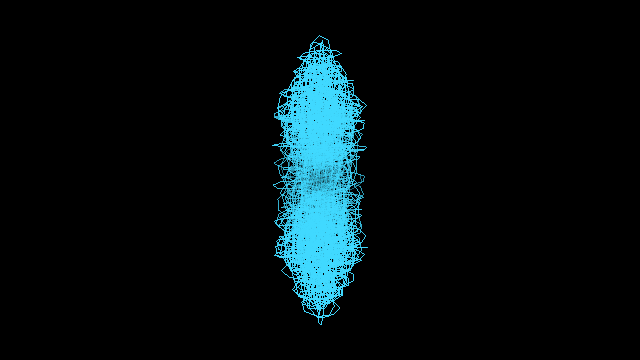
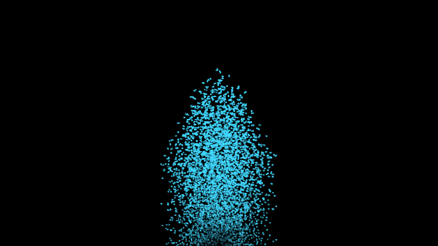
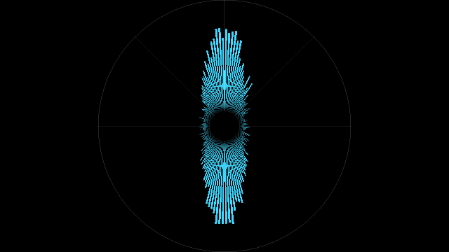
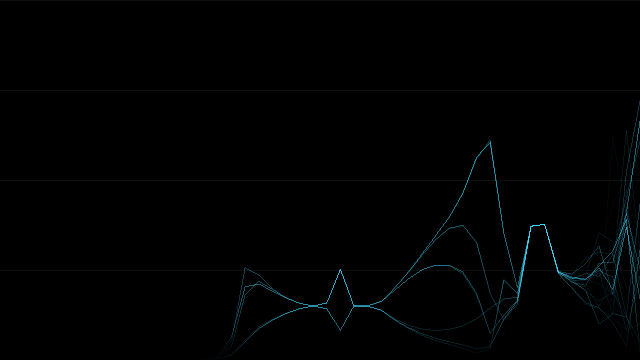
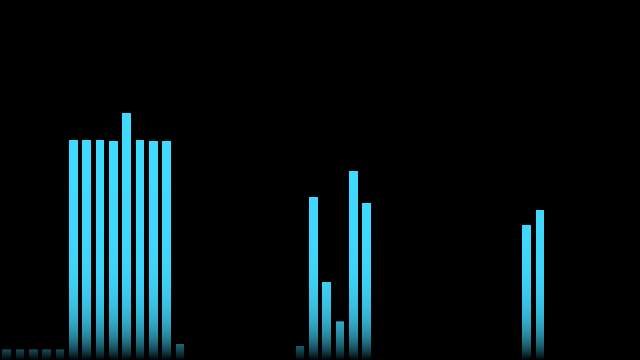
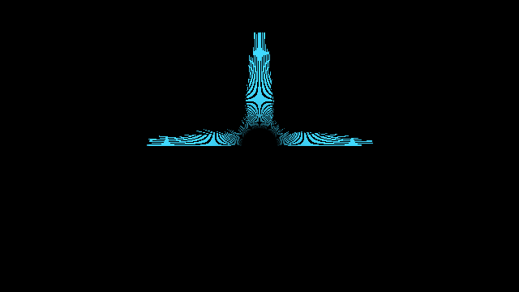

# spasis

> **AI-assisted project.** This codebase was created with [Claude](https://claude.com/claude-code)
> (Anthropic), directed and reviewed by a human author. The central claim — that
> one law reproduces the instrument engineers already own and keeps working past
> two channels — is not asserted but measured: `sptest --field` fails if a
> hard-panned channel stops landing at 45°, and `sptest --width` fails if the
> width reading stops agreeing with `|S|/(|M|+|S|)` at any landmark. Both drive
> the analysis code that ships.
>
> **It runs in Resolume Arena on macOS and Windows, and it has not yet run a
> show.** All four sources load and register in Arena 7.27.1 on both platforms,
> expose their controls correctly, and have captured live audio from a real
> CoreAudio device. What has *not* happened is a real desk feeding a real
> multichannel layout for a real audience — and first contact with a live rig
> found five bugs in a plugin that had already passed three hundred offline
> checks. Check it in your own rig before trusting it in front of an audience.

Four audio sources for Resolume Arena and Avenue that draw the **shape of the
stereo and surround field** — where the energy is pointing, how wide each part
of the spectrum is, and what the balance looks like — as sonar-style displays
you can put on a screen rather than in a meter bridge.

| Source | What it shows |
|---|---|
| **Spasis Field** | The goniometer. Where the signal sits, instant by instant. |
| **Spasis Rose** | Polar level: energy against direction, or a lobe per speaker. |
| **Spasis Width** | Stereo width against frequency. |
| **Spasis Balance** | Tonal balance. |

Every one of them takes the same two controls: a **Shape** — circle, half
circle, or the whole raster — and a **Style** — oscilloscope, bargraph, or
particles. Four displays × three shapes × three styles is thirty-six pictures
out of one set of controls that behaves the same way in all four plugins.

| | |
|---|---|
|  |  |
| **Field**, circle, oscilloscope — the trace itself | **Field**, half circle, particles |
|  |  |
| **Rose**, circle, bars — energy by direction | **Width** against frequency: correlated bass, decorrelated air |
|  |  |
| **Balance**, raster, bars | **Rose**, half circle |

<sub>Every image is rendered by `sptest`, the offline harness, from a synthetic
programme — not a Resolume screen capture. Regenerate them with
`./build/sptest --sheet docs/sheet 2`.</sub>

## Why it captures its own audio

FFGL — the Resolume plugin API — offers a plugin exactly one audio input: a
buffer parameter carrying N magnitude bins of a **mono sum**. No phase, no
channels, no time-domain samples.

Every display above except tonal balance needs at least two of those. A
goniometer needs L and R as waveforms; per-band width needs the complex spectrum
of each channel separately; a surround rose needs six. None of it can be
recovered from a mono magnitude spectrum, and a plugin that guessed would draw
four plausible pictures of nothing.

So spasis opens its own capture device — anything the machine offers, including
a loopback like [BlackHole](https://existential.audio/blackhole/), a Dante
Virtual Soundcard, or an interface with the desk feeding it. Point **Audio
Input** at it and pick the **Speakers** layout that matches.

Left on its default, **Audio Input** is `Resolume (mono)` and the host's own FFT
drives it. That path needs no setup at all and works in any host — and it can
only show **Balance**.

The other three then draw their **graticule at full brightness and nothing
else**: an empty instrument rather than a black frame. The same happens when a
chosen device is delivering digital silence — no permission, an unpatched Dante
receiver, a loopback nothing is routed to. FFGL gives a plugin no way to draw
text and no window, so spasis cannot say *why* in words; what it can do is not
be indistinguishable from a plugin that has crashed.

## Speaker layouts

Stereo, quad, 5.1, 7.1, or an even ring of any channel count up to eight. LFE
contributes a level and never a direction. Height channels are shaded rather
than moved: a flat picture cannot show elevation, and putting a ceiling speaker
somewhere on the horizontal plane would be inventing a position.

The stereo layout is **±45°, not the ITU ±30°**, and that is the most
consequential number in the project. The field point for one instant is the
amplitude-weighted sum of the unit vectors to each speaker; at ±45° that comes
out as exactly `(side, mid)`, which *is* the classic goniometer — mono up the
vertical axis, out-of-phase flat on the horizontal. The generalised law and the
instrument every engineer already owns are the same thing, and they are only the
same thing at 45°.

<!-- downloads:start -->

## Download

No release has been published yet. This block is written by
`stoatworks-backend/release/gen-downloads.py` from the releases API once a tag
exists, so it is a placeholder rather than a hand-maintained table — do not
fill it in by hand.

<!-- downloads:end -->

## Install

Drop all four bundles (macOS) or all four `.dll`s (Windows) into Resolume's
extra effects folder and restart Resolume:

- macOS — `~/Documents/Resolume Arena/Extra Effects/`
- Windows — `Documents\Resolume Arena\Extra Effects\`

Use `Resolume Avenue` in place of `Resolume Arena` for Avenue. They appear as
four **sources** — not effects — named **Spasis Field**, **Spasis Rose**,
**Spasis Width** and **Spasis Balance**.

Install all four or install one; they share no state and none of them needs the
others. What they do share is the **Audio Input** control, and three of the four
show nothing but their graticule until you point it at a real capture device —
see [Why it captures its own audio](#why-it-captures-its-own-audio) above.

On macOS the microphone permission belongs to **Resolume**, not to the plugin,
and a host that does not have it is not given an error: the device opens, runs,
and returns digital zero for ever. That is indistinguishable from an unpatched
Dante receiver or a loopback nothing is routed to, so spasis calls all three
what they are — silence — after three seconds of bit-exact zero. If a device is
selected and the display says it is silent, check Resolume under **System
Settings › Privacy & Security › Microphone** before suspecting the routing.

## Building

```bash
git clone --recursive https://github.com/stoatworks-labs/spasis
cd spasis
cmake -B build -DCMAKE_BUILD_TYPE=Release
cmake --build build
cmake --install build      # into ~/Documents/Resolume Arena/Extra Effects
```

macOS builds universal (arm64 + x86_64) by default. Windows needs vcpkg for
GLEW; the manifest is in `vcpkg.json`.

## Testing

```bash
tools/verify.sh
```

| flag | what it proves |
|---|---|
| `--fft` | the vendored transform matches a direct DFT to within -80 dB |
| `--field` | mono is vertical, anti-phase is horizontal, a hard-panned channel is at 45°, and the ITU layout puts it at 30° instead |
| `--width` | width agrees with `\|S\|/(\|M\|+\|S\|)` at every landmark, and generalises to six channels |
| `--lfe` | an LFE-only 5.1 signal leaves the field at the origin and still reads a level |
| `--fallback` | the host-FFT path leaves field, rose and width **empty** rather than inventing them |
| `--ring` | the capture ring drops the oldest audio, never the newest, and counts the drops exactly |
| `--shaders` | every shader compiles on this driver, with the driver's own message when one does not |
| `--sheet` | renders twelve displays and fails any that come out blank or solid |

## Licence

MIT. See [ATTRIBUTIONS.md](ATTRIBUTIONS.md) for the submodules and the code
carried across from sibling repos.
